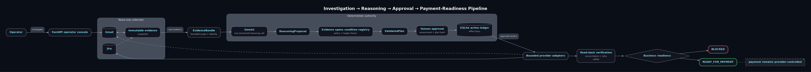

# ClearDue — find the blocker, prove what clears it

An invoice can be commercially blocked even when engineering says “Done.” ClearDue helps finance, delivery and customer-success teams answer: **What is the smallest justified action that makes this invoice payable?**

It finds evidence blocking an implementation-services invoice, proposes the smallest supported resolution, executes only approved operational actions, verifies them by read-back, and re-evaluates when evidence changes.

The demonstration starts with a ₹24,00,000 fixture invoice. Jira says delivery is done, but the customer's migration acceptance test failed and training approval is missing. ClearDue prepares a useful remediation and customer draft. Migration acceptance alone is insufficient; only the remaining authorized approval clears the reviewed conditions. The money and payment status remain unchanged.

## Try the proof in one command

After installing dependencies, run `python scripts/prove_demo.py`. It asserts the complete fixture business loop, response-loss reconciliation, duplicate replay with zero additional mutations, and unauthorized-acceptance rejection. No keys or external writes are involved. This is a labeled simulation, not live-provider proof.

## Architecture

ClearDue separates interpretation from authority. Gemini proposes meaning from a bounded snapshot; deterministic code decides what is valid, allowed and verifiable.



Gemini receives only the bounded EvidenceBundle. It has no credentials, provider clients, database access or write tools. Deterministic code owns identity, money, condition IDs, evidence spans, approvals, targets, idempotency, retries, reconciliation, verification and readiness. `READY_FOR_PAYMENT` never means payment occurred.

## Fixture demo

```powershell
py -3.12 -m venv .venv
.\.venv\Scripts\python.exe -m pip install -r requirements.txt
Copy-Item .env.example .env
.\.venv\Scripts\python.exe scripts\run_professional.py --new-run --port 8001
```

Open `http://127.0.0.1:8001`. `--new-run` starts a separate rehearsal database and preserves all earlier runs. The console trusts the local operator and is restricted to loopback; it does not provide production login or multi-user authorization. Use the fixture-only controls to demonstrate response-loss recovery, new evidence, automatic re-evaluation, unauthorized acceptance rejection and duplicate replay. Fixture evidence and effects are labeled simulation.

## Live setup

Set `CLEARDUE_MODE=live`, `GEMINI_API_KEY`, `GEMINI_MODEL=gemini-3.6-flash`, Gmail OAuth paths, Jira credentials/project, Razorpay Test Mode credentials, `DEMO_INVOICE_ID`, `DEMO_APPROVER_EMAIL`, `DEMO_PROJECT_REF`, and explicit `DEMO_JIRA_ISSUE_IDS`. Use a new database and case for a new run. Never paste secrets into chat or commit `.env`.

```powershell
.\.venv\Scripts\python.exe scripts\preflight.py --authorize-gmail
.\.venv\Scripts\python.exe scripts\preflight.py
.\.venv\Scripts\python.exe scripts\setup_professional_live.py --binding data\professional-binding.json
.\.venv\Scripts\python.exe -m uvicorn app.main:app --host 127.0.0.1 --port 8001
```

Setup performs provider reads and saves only local state. Investigate read-only first; approving a live plan performs external writes. See [live setup](docs/professional-live-setup.md).

## Verification

```powershell
.\.venv\Scripts\python.exe -m pytest -q
.\.venv\Scripts\python.exe evals\run.py --db data/professional-fixture.db
.\.venv\Scripts\python.exe scripts\prove_demo.py
.\.venv\Scripts\python.exe -m compileall -q app scripts evals tests
node --check app\static\app.js
.\.venv\Scripts\python.exe -m pip check
```

Evaluation reports actual executed counts. Fixture results are not live-provider claims. Historical live objects and rejected attempts remain in the original private database and are not reset by the fixture launcher.

See [measured verification and evidence limits](docs/verification.md). GitHub Actions runs the same offline checks on pushes. No repository secrets are required for CI.

## Limitations and disclosure

This is a single-process SQLite operator console with bounded polling and conservative English authority checks. Ambiguous evidence requires human review. “Minimum” means the fewest writes among the supplied candidates that cover the required work, not a global optimization guarantee. Exact citation coverage measures exact text references, not semantic truth. It builds on an earlier multi-app hackathon prototype; disclose that foundation when submitting. Do not claim live outcomes that were not observed.

See [reliability](docs/reliability.md) for the evaluation model and known limits.
